# Current-build screenshots

Captured on September 6, 2026, from an x64 .NET Framework 4.8 build of commit `1d5b68d5813917213eb322f73d1794e6b256d952`, before the 1.7.5 version bump. The application displays version 1.7.4.0 while illustrating features included in **1.7.5**. These are pre-release source-build captures, not screenshots of the published release package. See the [1.7.5 release summary](releases/1.7.5.md).

The gallery below contains 11 pre-release application captures and two supplied desktop examples. Click an image to open the full-size PNG.

| Image | Suggested placement |
| --- | --- |
| [Split workspace](images/latest-build/workspace-split.png) | README overview; getting started; layouts |
| [SSH connection](images/latest-build/ssh-connected.png) | SSH connection types |
| [Command Prompt](images/latest-build/command-prompt.png) | Local Windows shells |
| [PowerShell](images/latest-build/powershell.png) | Local Windows shells |
| [General options](images/latest-build/options-general.png) | Client executable configuration |
| [Edit session](images/latest-build/edit-session.png) | Creating and editing saved sessions |
| [Restart shortcut](images/latest-build/restart-shortcut.png) | Shortcut configuration; Ctrl+Shift+R is an example assignment, not a default |
| [Close confirmation](images/latest-build/confirm-close-session.png) | Closing an active session; Cancel is the default |
| [Completed file transfer](images/latest-build/scp-file-transfer.png) | SCP browser and transfer results |
| [Layout menu](images/latest-build/layout-menu.png) | Saving a named layout |
| [RDP login](images/latest-build/rdp-login.png) | RDP authentication; full-window context, with a small remote login dialog |

## Screenshot gallery

### Split workspace

[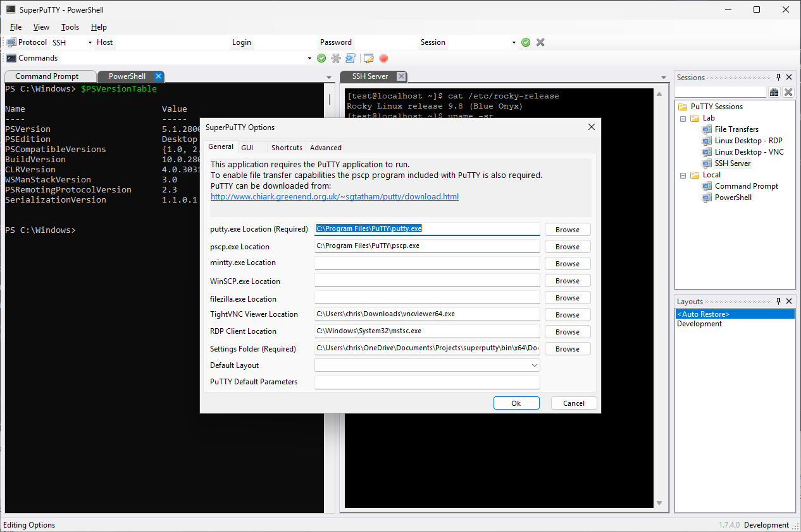](images/latest-build/workspace-split.png)

### SSH connection

[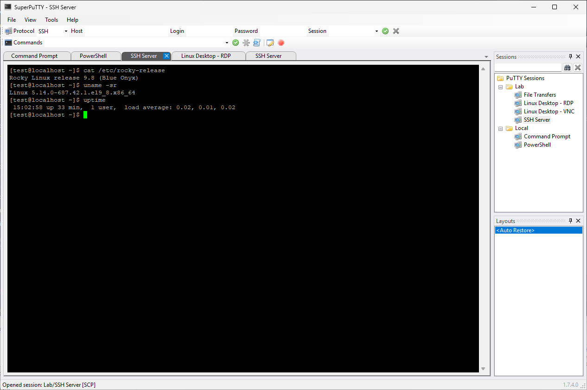](images/latest-build/ssh-connected.png)

### Command Prompt

[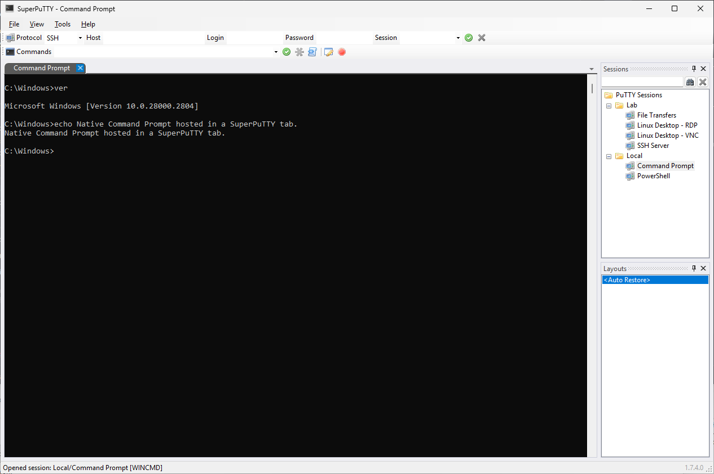](images/latest-build/command-prompt.png)

### PowerShell

[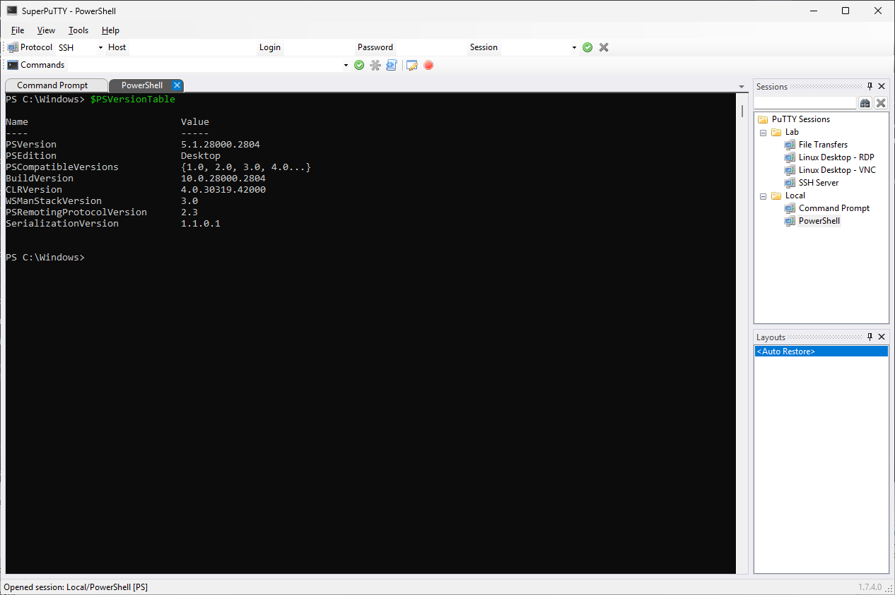](images/latest-build/powershell.png)

### General options

[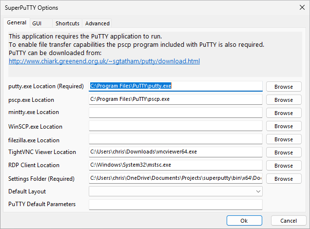](images/latest-build/options-general.png)

### Edit session

[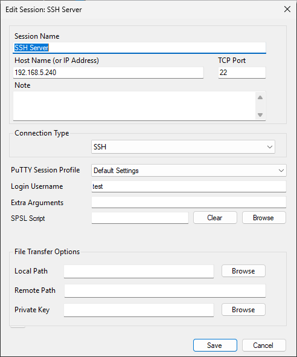](images/latest-build/edit-session.png)

### Restart shortcut

[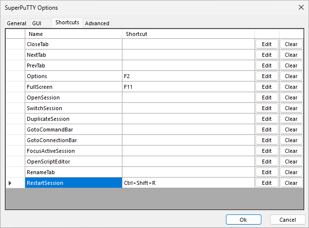](images/latest-build/restart-shortcut.png)

### Close confirmation

[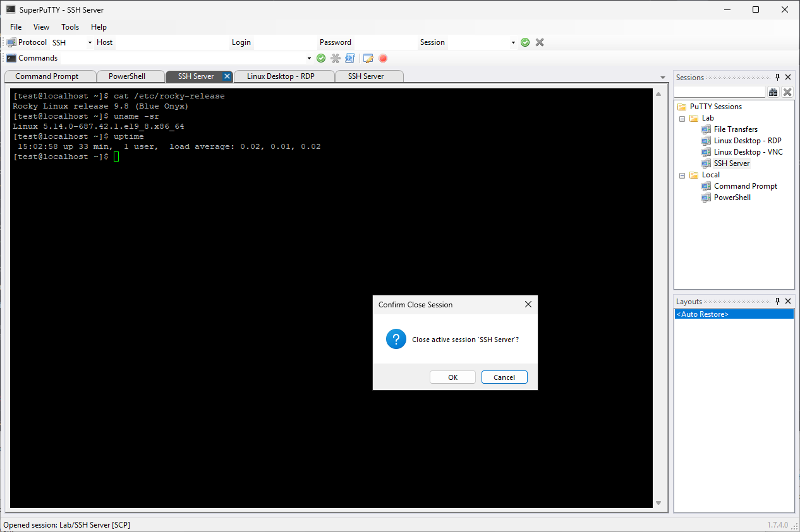](images/latest-build/confirm-close-session.png)

### Completed file transfer

[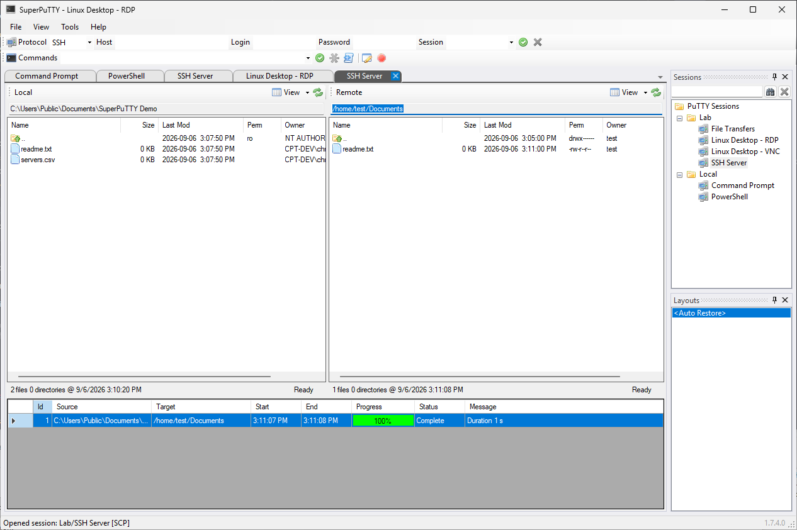](images/latest-build/scp-file-transfer.png)

### Layout menu

[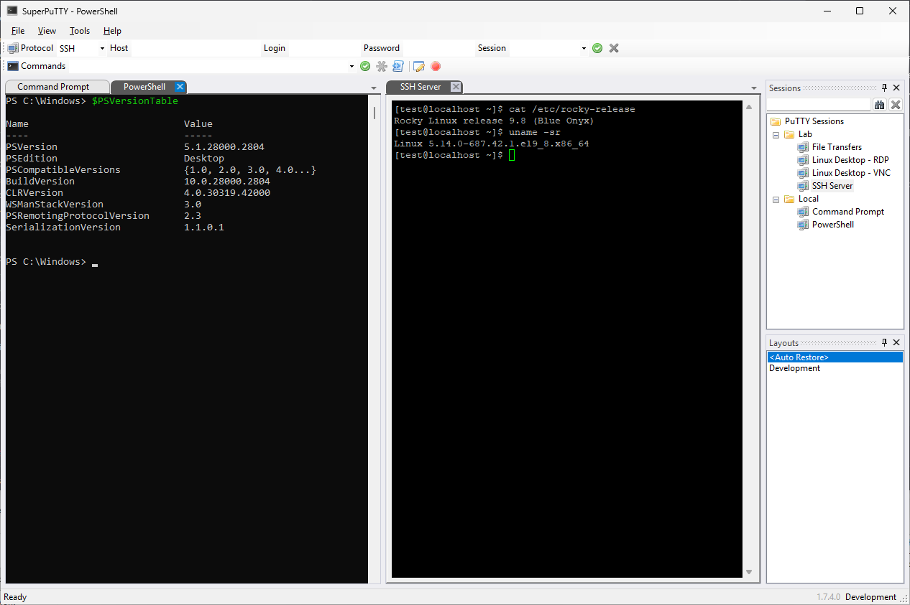](images/latest-build/layout-menu.png)

### RDP login

[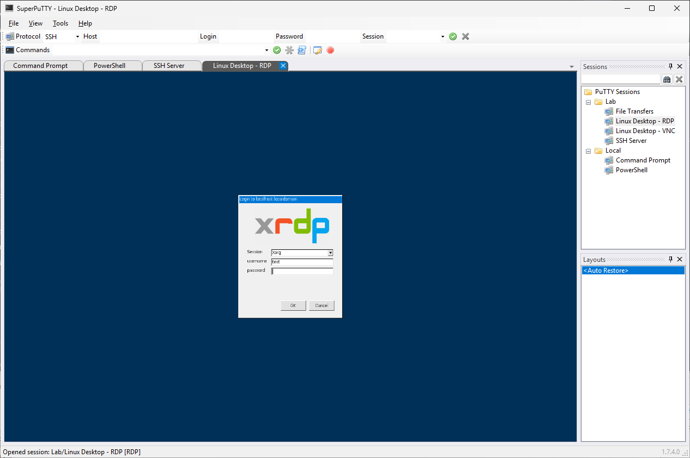](images/latest-build/rdp-login.png)

## Capture details

- Images are actual application screenshots, without generated or composited UI.
- Main-window captures are 1266 x 843 pixels; setup dialogs are captured separately at their native size.
- A separate documentation profile was used. The original seven images in `images` are unchanged.
- Connections used the designated `test` account on the test VM. Passwords were entered into authentication prompts and are not included in the images or this directory.
- Some screens show the test VM's private address or local executable/settings paths. Review those details before public publication if generic paths are preferred.
- The SCP example shows an actual completed transfer of a sample `readme.txt` file.

## Supplied desktop examples

Fresh connected VNC and RDP desktop captures were not obtained: both showed black desktops after authentication during this run. SSH and SCP worked. Multiple `test` sessions were visible on the VM; the cause of the black desktops has not been established. Existing graphical sessions were not terminated to obtain screenshots.

The RDP login screenshot is suitable as a secondary reference, but a larger login-dialog capture would be easier to read.

The following user-supplied images provide connected-desktop examples from a separate run. They are not presented as captures from the current-source build or the 1.7.5 release package.

