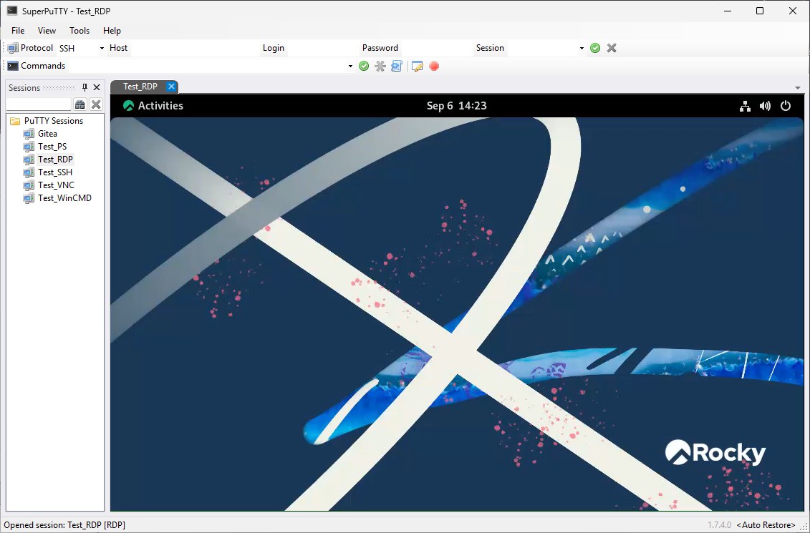
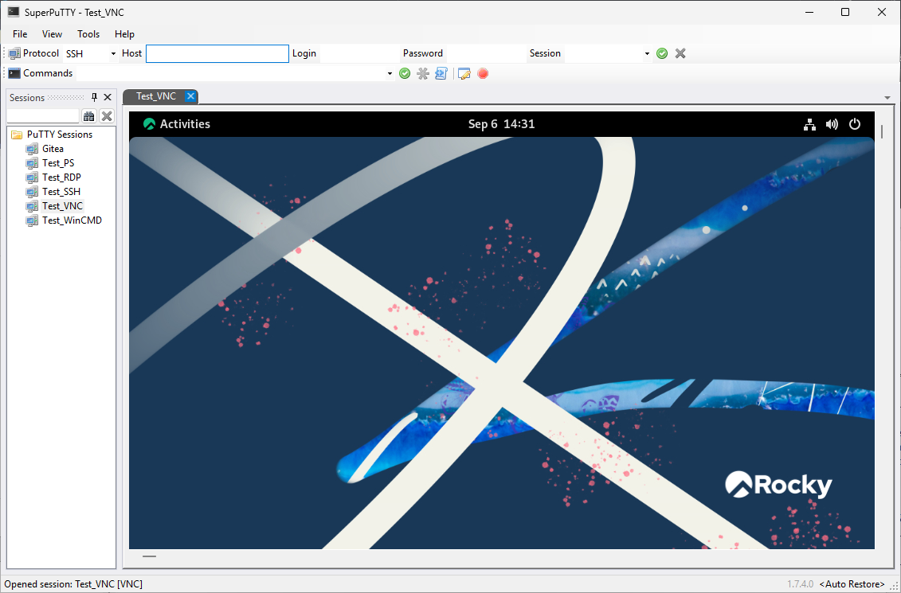

# Connection Types

[Back to the manual](README.md)

SuperPuTTY organizes and hosts connections, while PuTTY or another configured client performs most protocol work. Program paths are configured under **Tools > Options > General**.

| Session type | Client and behavior |
| --- | --- |
| SSH | Opens a PuTTY SSH terminal. PuTTY profiles can provide terminal, proxy, algorithm, and authentication settings. |
| SCP | Opens the integrated two-pane browser backed by `pscp.exe`. See [SCP file transfers](scp-file-transfers.md). |
| Telnet, Rlogin, Raw | Opens PuTTY with the selected network protocol. |
| Serial | Opens PuTTY in serial mode. The host field represents the serial line configured for the session. |
| RDP | Normally hosts Microsoft's RDP ActiveX client directly in a tab and updates the remote display as the tab is resized. A configured FreeRDP executable, or MSTSC-specific extra arguments, uses the external-window hosting path. |
| VNC | Starts the configured external VNC viewer and hosts its window in a tab. |
| CygTerm | Uses the configured PuTTY/Cygterm environment and its local shell options. |
| MinTTY | Starts the configured MinTTY executable and hosts its window in a tab. |
| Win CMD | Starts `cmd.exe` through `conhost.exe` and hosts the resulting native console window in a dedicated tab panel. |
| PowerShell | Starts Windows PowerShell through `conhost.exe` and hosts the resulting native console window in a dedicated tab panel. |

The saved values `SSH2` and `SSHNet` may appear in older or experimental session files. They are retained for compatibility and are handled as ordinary SSH; they are not separate clients in the current session editor.

## External client considerations

SuperPuTTY discovers and embeds top-level windows created by PuTTY, FreeRDP, VNC, MinTTY, and similar programs. Client upgrades that change window titles or startup behavior can affect capture. When troubleshooting, first run the exact configured executable and arguments outside SuperPuTTY, then review the SuperPuTTY log.

TigerVNC is recognized by its executable path or embedded product information, including when renamed to `vncviewer.exe`. SuperPuTTY passes an explicit port as `host::port` (for example, `192.168.5.240::5902`) and leaves authentication to the viewer's prompt. The VNC executable picker accepts versioned filenames. Other viewers retain the existing TightVNC-style arguments.

For TigerVNC, SuperPuTTY continues watching the launched viewer after capturing the login dialog. When the remote desktop window appears, it replaces the login window in the tab. Tracking also handles a replacement desktop window after reconnecting; options and authentication dialogs do not replace an already captured desktop. Discovery is limited to the launched viewer process and recognizes TigerVNC's desktop window title.

If a viewer exits during startup, SuperPuTTY stops trying to capture its window and logs the executable path and exit code. Check the viewer's arguments and connection settings. In particular, TigerVNC sessions should use `host::port`, without the TightVNC-only `-scale=auto` and `-port=` arguments.

Win CMD and Windows PowerShell use the existing native Windows console host. The current implementation does not use ConPTY, WebView2, or a browser-based terminal renderer.

## Arguments and credentials

**Extra Arguments** are plain text and are passed to the selected client. SuperPuTTY removes recognized embedded password switches while constructing PuTTY and PSCP arguments, but secrets should never be stored in this field. Quote non-secret paths or values containing spaces as required by the external client.

For SSH authentication, prefer a PuTTY profile and Pageant. For SCP, use the session's explicit **Private Key** field or the protected password prompt described in [SCP file transfers](scp-file-transfers.md).

## Desktop examples

These user-supplied screenshots show connected desktops hosted in SuperPuTTY. They are visual examples from a separate run, not captures of the 1.7.5 release package.

See the [current-source screenshot gallery](../README.md) for session setup, layouts, shortcuts, close confirmation, and file transfers.
